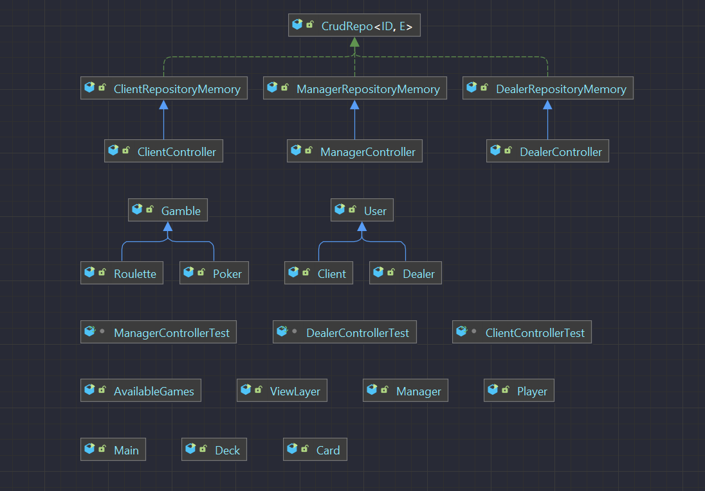

# Casino
MAP-Projekt: Casino Story

Generelle Informationen
Wir haben uns genau ein Casino eröffnet, wo man bisher nur einige Glücksspiele versuchen kann. Ein Glücksspiel hat einen Namen, einen Tisch, eine maximale Anzahl von Spielern, eine Liste von eingeschriebenen Kunden und einen Dealer. Jeder Kunde ist eine Person, die auch aktuelles, gewonnenes und verlorenes Geld und Anzahl von gewonnenen und verlorenen Spielen hat und jeder Dealer ist auch eine Person, die ebenfalls eine Liste von bekannten Glücksspielen.
Die Anwendung ermöglicht es den Kunden, ein bestimmtes Glücksspiel zu zocken, das einen bestimmten Dealer hat.
Mit der Anwendung kann man:
1.	Als Manager:
      a.	Alle Kunden, die schon registriert sind, anzeigen. Das kann man in verschiedener Reihenfolge nach ID, Alter, Name, gewonnenem oder verlorenem Geld.
      b.	Alle Dealers, die schon registriert sind, anzeigen. Das kann man in verschiedener Reihenfolge nach ID, Alter oder Name.
      c.	Einen neuen Manageraccount erstellen. Das kann man machen, wenn man die ursprünglichen Accountdaten kennt.
2.	Als Dealer:
      a.	Einen neuen Dealeraccount erstellen.
      b.	Ein neues Glücksspiel lernen, um die Kunden diesen Dealer für dieses bestimmte Spiel auswählen zu können.
      c.	Alle gelernten Spiele anzeigen.
3.	Als Kunden:
      a.	Einen neuen Kundenaccount erstellen.
      b.	Ein Glücksspiel zu versuchen. Bevor man spielen kann, muss man zuerst den Tisch, den Dealer und den Anzahl von erlaubten Playern für das bestimmte Glücksspiel auswählen.
      c.	Mehr Geld einzahlen.
      d.	Deine Informationen anzeigen. (gewonnene oder verlorene Spielen, aktuelles Geld und gewonnenes und verlorenes Geld)

Dokumentation von Random der schon implementierten Glücksspielen

1.	Roulette:
      Roulette ist ein einfaches Glücksspiel. Erstens sollte man auswählen, was man geraten möchte: ob die zufällige Zahl ungerade oder gerade ist oder welche Zahl im Intervall [1, 36] ist.
      Also benutzen wir für jedes Spiel einen verschiedenen Generator, der vom Typ Random ist, damit man eine zufällige Zahl bekommt. Zusammenfassend können wir noch behaupten, dass das Programm den Input des Benutzers mit “rouletteNum” vergleicht.

2.	Poker:
      Poker ist ein viel kompliziertes Glücksspiel, sodass man mehrere Informationen darüber hier https://praxistipps.focus.de/regeln-fuer-poker-einfach-und-verstaendlich-erklaert_100351 finden kann.
      Wir benutzen ebenfalls dieselbe Klasse “Random”, die wir für das Shuffle von einem Deck verwenden. Dann sind die Karten ganz zufällig.

